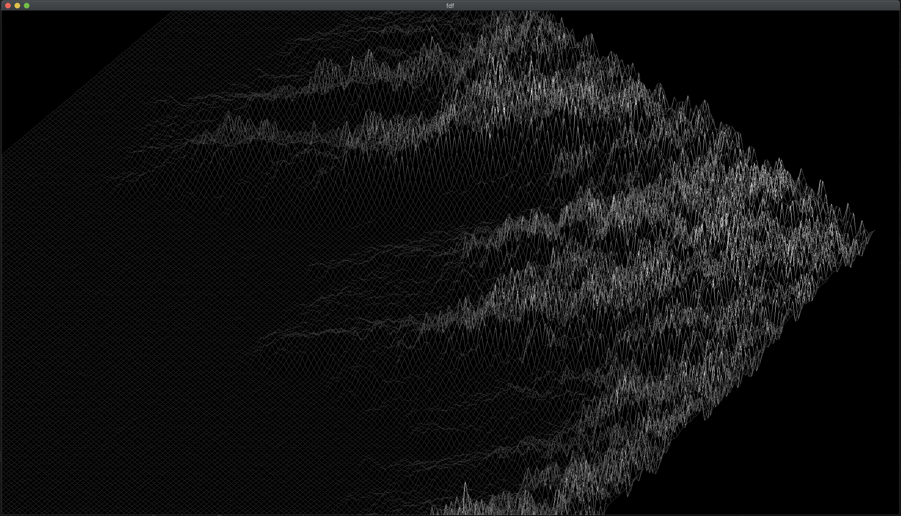

# FdF
3D wireframe renderer with some interaction abilities



# Installaion
You have to install `cmake` and `glfw` first, and then the MLX library. To do so, simply run
```
make mlx
```
then build the code
```
make
```

# Usage
You can render any map that you have with the following command
```
build/fdf maps/[MAP_NAME].fdf
```

# Keymap
|Key|Functionality|
|---|---|
|`scroll wheel`|Zoom in/out|
|`G` + mouse|Moving the map|
|`R` + mouse|Rotating the map|
